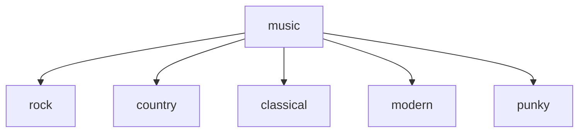

## 
 Upload MP3 Files

 

Now you can upload mp3 files to the sc card directly without having to remove it from the Box. &nbsp; This is done via web interface by using the Box as a HTTP server.

There are two modes that you can turn on the HTTP server:

1.  Enable the Box to act as an access point. &nbsp; In this mode, it will act as an AP with DHCP server.&nbsp;  This option is called `softAP` in the setting menu.
2.  Enable the Box to connect to your standalone or your WiFi router.&nbsp;  This option is called `Station` in the setting menu.

For option 1 (softAP), the default ssid is `Box_AP` and password is `password`. &nbsp; It can be changed in the `softap_example_main.c`

For option 2 (Station), you can change the ssid and password per your environment. &nbsp; Search for ssid in the `sdkconfig` file.

With HTTP server turned on, you can manage your mp3 such as create/delete new folders/files, upload/download files.

*****  This update also made one major change to the structure of the mp3 folders and files  *****

At the root of the sd card, a folder called "music" needed to be created. &nbsp; Under "music", there can any subfolders to hold diffrent mp3 files.

 

Lastly, there seemed to be a bug of memory issue. &nbsp; This randomly occurs if you have already interacted with lexin (when you heard a tts talking voice) before activate HTTP server.&nbsp;  As such, the HTTP server might not be able to start. &nbsp; To prevent this issue, whenever you need to manage mp3 files, just hit the reset to go directly to the setting menu.

